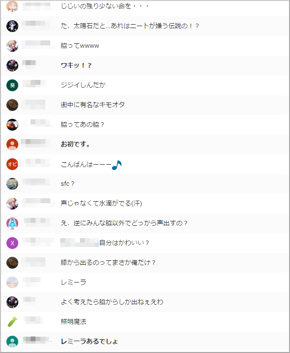
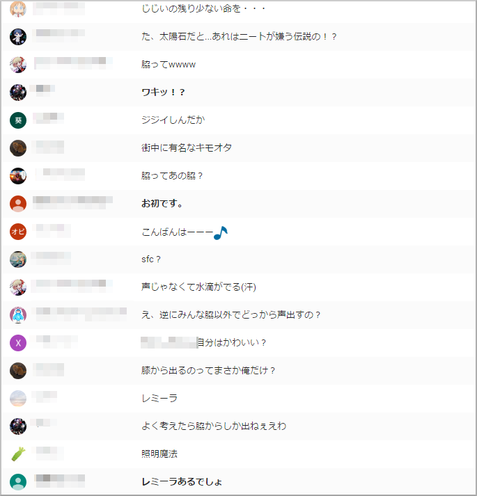

# YouTube Live First Comment Checker
## 概要（Description）
YouTube Liveのチャット（live_comments）の初コメを太字にするChromeプラグインです。  
このプラグインを利用するには[Google Chrome](https://www.google.com/intl/en/chrome/browser/desktop/)が必要です。
[Opera](http://www.opera.com/)では[Download Chrome Extension](https://addons.opera.com/en/extensions/details/download-chrome-extension-9/)というプラグインを入れることで、このプラグインを利用できます。

## 使い方（Usage）
1. このフォルダを解凍します。すでに解凍されている場合はこの操作は不要です。
1. Google Chromeを開きます。
1. アドレスバーに以下のURLを入力し実行して拡張機能画面を開きます。
```
chrome://chrome/extensions/
```
1. 「デベロッパーモード」にチェックをつけます。
1. 「パッケージ化されていない拡張機能を読み込む」というボタンを押してこのフォルダを読み込みます。

## イメージ図（Illustrative purposes）



